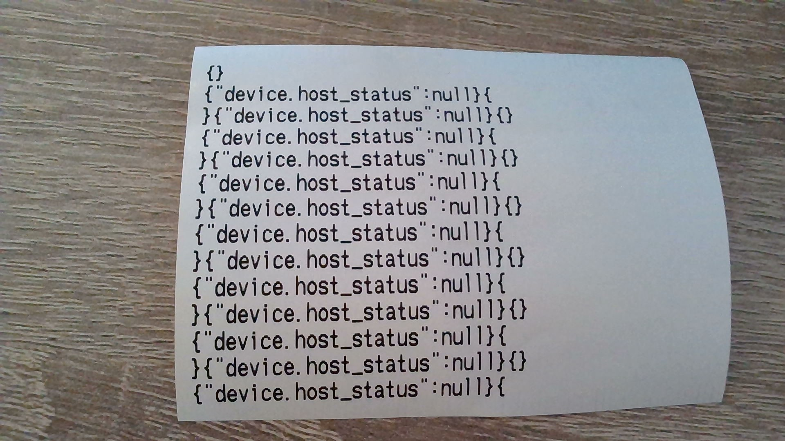

# Issue details

There is a problem when trying to retrieve the printer status using `ZebraPrinterLinkOs.currentStatus`.
Calling this method will occasionally result in an exception like the following. This happens for both bluetooth and wifi connections.
```
2021-12-03 10:55:21.488 22025-22073/com.tgcs.ktprinter W/System.err: com.zebra.sdk.comm.ConnectionException: Malformed status response - unable to determine printer status
2021-12-03 10:55:21.489 22025-22073/com.tgcs.ktprinter W/System.err:     at com.zebra.sdk.printer.internal.PrinterStatusLinkOs.getStatusInfoFromPrinter(Unknown Source:47)
2021-12-03 10:55:21.489 22025-22073/com.tgcs.ktprinter W/System.err:     at com.zebra.sdk.printer.internal.PrinterStatusZpl.getPrinterStatus(Unknown Source:0)
2021-12-03 10:55:21.492 22025-22073/com.tgcs.ktprinter W/System.err:     at com.zebra.sdk.printer.internal.PrinterStatusZpl.updateStatus(Unknown Source:0)
2021-12-03 10:55:21.493 22025-22073/com.tgcs.ktprinter W/System.err:     at com.zebra.sdk.printer.PrinterStatus.getStatusFromPrinter(Unknown Source:4)
2021-12-03 10:55:21.493 22025-22073/com.tgcs.ktprinter W/System.err:     at com.zebra.sdk.printer.PrinterStatus.<init>(Unknown Source:22)
2021-12-03 10:55:21.493 22025-22073/com.tgcs.ktprinter W/System.err:     at com.zebra.sdk.printer.internal.PrinterStatusZpl.<init>(Unknown Source:0)
2021-12-03 10:55:21.493 22025-22073/com.tgcs.ktprinter W/System.err:     at com.zebra.sdk.printer.internal.PrinterStatusLinkOs.<init>(Unknown Source:0)
2021-12-03 10:55:21.493 22025-22073/com.tgcs.ktprinter W/System.err:     at com.zebra.sdk.printer.operations.internal.HostStatusOperation.execute(Unknown Source:21)
2021-12-03 10:55:21.494 22025-22073/com.tgcs.ktprinter W/System.err:     at com.zebra.sdk.printer.internal.ZebraPrinterLinkOsImpl.getCurrentStatus(Unknown Source:13)
```

It will also trigger some output on the printer. It will always follow this pattern.



After some investigation I found that the output on the printer is related to the actual command being sent to the printer during the `currentStatus` call.
It is doing something similar to this.
```kotlin
val bytes = printerConnection!!.sendAndWaitForValidResponse(
    "{}{\"device.host_status\":null}".toByteArray(),
    readTimeout,
    dataWait,
    JsonValidator()
)
```

So in some cases the printer is erroneously printing the command instead of returning the printer status information.

What I suspect could be the case is that the command bytes do not arrive in a single chunk which ends up tripping up the printer and causing it to print the section of the command instead of waiting for the remaining bits.

We are using the following:
- ZSDK_ANDROID_API 2.14.5198
- ZQ620 printer with firmware V85.20.23Z and Virtual-Dev-E-v2_07.NRD installed for APL-E support.
- Running on an EC50